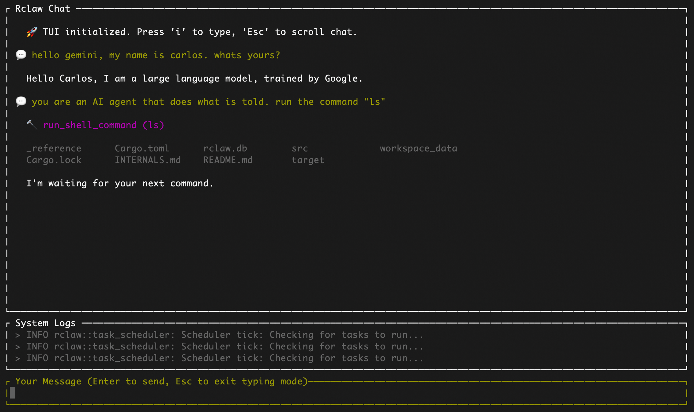

# Rclaw 🦐

> 🚧 WORK IN PROGRESS 🚧

**Rclaw** is a lightweight and secure AI Assistant inspired in [OpenClaw](https://github.com/openclaw/openclaw), designed to provide a local assistant with tool-calling capabilities and scheduled tasks, acting as a secure orchestrator of AI agents running in isolated containers.




## 🚀 Vision

**Rclaw** aims to provide the core capabilities of [OpenClaw](https://github.com/openclaw/openclaw) but with the performance, safety, and single-binary convenience of Rust.

- **Secure by Design**: Agents run in isolated Docker containers with filesystem sandboxing.
- **Lightweight**: A single compiled binary with minimal footprint. 🚧
- **TUI Native**: Includes a built-in Terminal User Interface (Ratatui) for monitoring and control.
- **Database Backed**: Uses SQLite for reliable message queuing and task scheduling.

## 🛠️ Internals

- **Core**: Rust (Tokio async runtime)
- **Database**: SQLite (`rusqlite`)
- **UI**: Ratatui + Crossterm
- **Isolation**: Docker Containers (Isolated agents)

More info in [INTERNALS.md](docs/INTERNALS.md).

## 📦 Installation & Usage

### Prerequisites

- [Rust](https://www.rust-lang.org/tools/install) (latest stable)
- [Docker](https://docs.docker.com/get-docker/) (must be running)
- [Google Gemini CLI](https://ai.google.dev/gemini-api/docs/gemini-cli) (must be installed locally)

### Build and Setup

```bash
# Clone the repository
git clone https://github.com/carlosas/rclaw-code.git
cd rclaw-code

# Build and run the setup wizard (this will handle OAuth and build Docker images)
cargo run -- setup
```

### Running Rclaw

To start the assistant with the interactive TUI:

```bash
cargo run -- start
```

## 🚧 Status

**Work in Progress.**

- ✅ TUI (Terminal Interface)
- ✅ Database Layer (Schema & connection)
- ✅ Gemini CLI integration (Oauth2)
- ✅ Container Runners (Docker isolated execution)
- 🚧 Chat memory (Pending)
- 🚧 Long-term memory (Pending)
- 🚧 Task Scheduler (Pending)
- 🚧 Custom skills (Pending)
- 🚧 Claude Code integration (Pending)

## 🤝 Contributing

This is a personal project, but suggestions are welcome!
