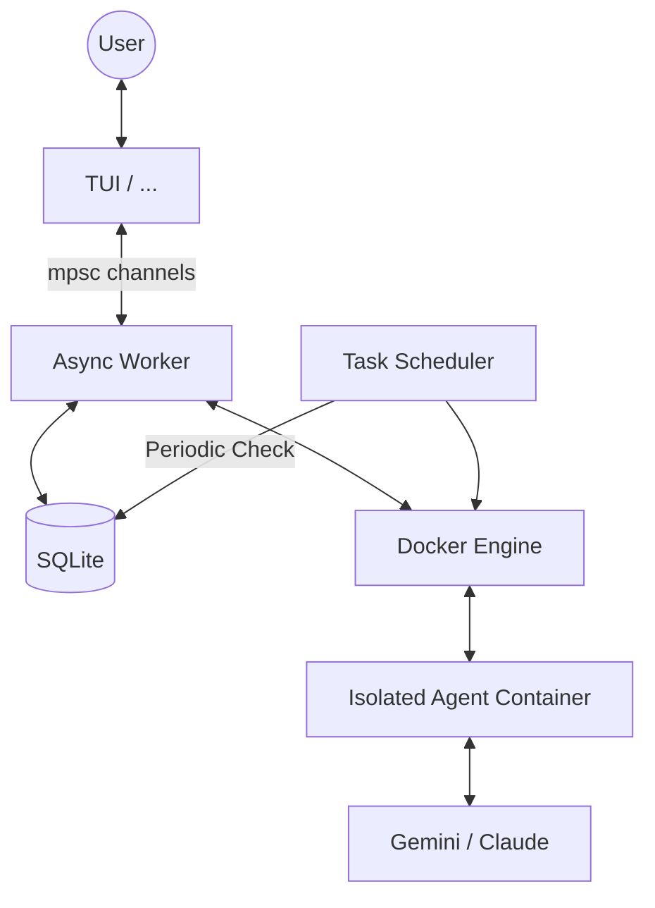

# Rclaw Internals - Architecture & Design

Rclaw is a lightweight Rust imitator of [OpenClaw](https://github.com/openclaw/openclaw), designed to provide a local AI assistant interface with tool-calling capabilities and scheduled tasks.

## High-Level Architecture

The system is built on an asynchronous architecture using `tokio`, following a producer-consumer pattern between the Terminal User Interface (TUI) and a background Worker thread. Agents are executed in isolated Docker containers to ensure host security.

## Core Components

### 1. The TUI (Ratatui)

Powered by `ratatui` and `crossterm`. It handles user input and renders the chat history, system logs, and the input box.

- **Efficient Rendering:** Uses `Paragraph` widgets with `Wrap` for multi-line messages.
- **Dynamic UX:** Implements real-time scroll calculation and cursor positioning.
- **Tool Highlighting:** Parses and styles tool execution logs and results in distinct colors.

### 2. The Database (SQLite)

Uses `rusqlite` to manage persistence. To ensure thread safety in an async environment, the connection is wrapped in a `Mutex` inside an `Arc`.

- **`auth_store`:** Stores credentials and tokens.
- **`tasks`:** Stores scheduled prompts, cron expressions, and execution history.
- **`message_queue`:** Prepares for future multi-channel support.

### 3. Container / Agent Execution

This is the security boundary of Rclaw. Instead of running LLM-driven code directly on the host, Rclaw spawns ephemeral Docker containers with the LLM CLIs.

- **Execution Flow:**
 - **UID/GID Mapping:** Containers run with the host user's ID to ensure correct permissions on mounted volumes.
 - **Automatic Auth Mounting:** Host credentials (e.g., `~/.gemini`) are mounted as read-only into the agent's home.
 - Ephemeral containers (`--rm`) are launched for each prompt.
 - **IPC:** Communication happens via `stdin/stdout` using a Node.js `entrypoint.js` wrapper that processes `stream-json`.

### 4. Task Scheduler

A background service that polls the database every minute.

- **Supported Formats:** Standard Cron expressions and a simplified "every X [s/m/h/d]" format.
- **Auto-rescheduling:** Calculates the `next_run` time after each execution to ensure tasks persist correctly.

## Data Flow

1. **User Input:** User types a prompt in the TUI.
2. **Event Dispatch:** TUI sends an `AppEvent::Input` through a channel.
3. **Execution:** The background worker constructs a `ContainerInput` and triggers a `docker run`.
4. **Sandboxing:** The container starts, mounts the group's workspace to `/home/rclaw/workspace`, and executes the agent CLI.
5. **Tool Loop:** Gemini/Claude may execute shell commands inside the container. Rclaw captures these via the stream-json bridge.
6. **UI Update:** Results are sent back to the TUI for rendering.

## Performance Considerations

- **Modular Layers:** Docker's layer caching makes image building and deployment extremely fast.
- **Rust Safety:** Use of `Mutex` and `Arc` ensures that the Scheduler and the TUI can interact with the same database without data races.
