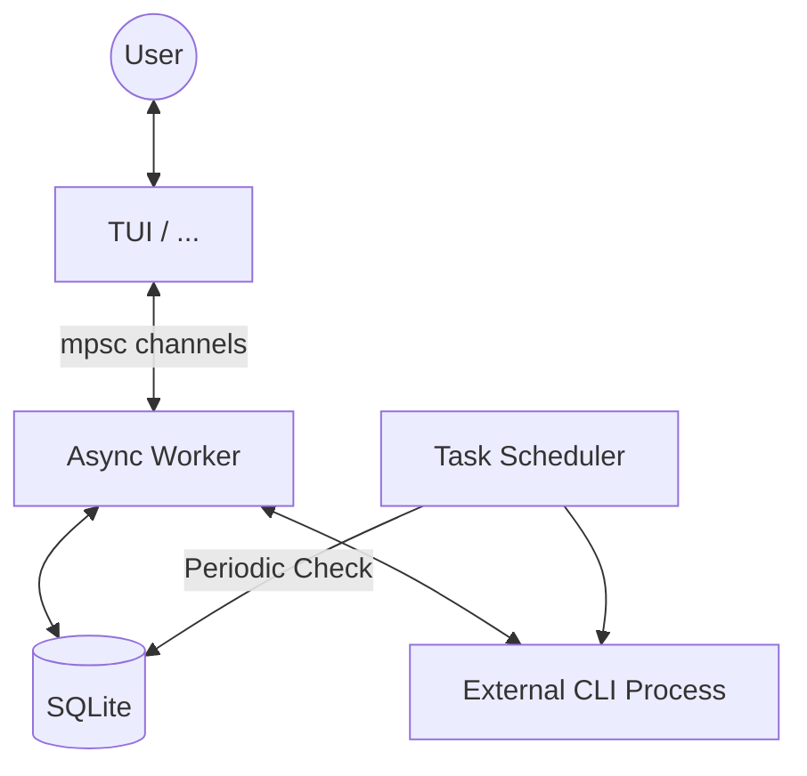

# Rclaw Internals - Architecture & Design

Rclaw is a lightweight Rust imitator of [OpenClaw](https://github.com/openclaw/openclaw), designed to provide a local AI assistant interface with tool-calling capabilities and scheduled tasks.

## High-Level Architecture

The system is built on an asynchronous architecture using `tokio`, following a producer-consumer pattern between the Terminal User Interface (TUI) and a background Worker thread.

## Core Components

### 1. The TUI (Ratatui)

Powered by `ratatui` and `crossterm`. It handles user input and renders the chat history, system logs, and the input box.

- **Efficient Rendering:** Uses `Paragraph` widgets with `Wrap` for multi-line messages.
- **Dynamic UX:** Implements real-time scroll calculation and cursor positioning.
- **Tool Highlighting:** Parses and styles tool execution logs and results in distinct colors.

### 2. The Database (SQLite)

Uses `rusqlite` to manage persistence. To ensure thread safety in an async environment, the connection is wrapped in a `Mutex` inside an `Arc`.

- **`auth_store`:** Stores Gemini API credentials.
- **`tasks`:** Stores scheduled prompts, cron expressions, and execution history.
- **`message_queue`:** Prepares for future multi-channel support.

### 3. Container / Agent Execution (External CLI Process)

This is the bridge between Rclaw and the AI.

- **External CLI Integration:** Spawns `gemini-cli` as a child process.
- **Stream-JSON Processing:** Instead of waiting for a full response, it processes the `stream-json` output format. This is crucial for capturing tool calls and intermediate thoughts in the exact order they were generated.
- **Tool Order Preservation:** Maintains chronological consistency between assistant messages and tool execution logs.

### 4. Task Scheduler

A background service that polls the database every minute.

- **Supported Formats:** Standard Cron expressions and a simplified "every X [s/m/h/d]" format.
- **Auto-rescheduling:** Calculates the `next_run` time after each execution to ensure tasks persist correctly.

## Data Flow

1. **User Input:** User types a prompt in the TUI.
2. **Event Dispatch:** TUI sends an `AppEvent::Input` through a channel.
3. **Execution:** The background worker receives the event, constructs a `ContainerInput`, and calls `run_container_agent`.
4. **Tool Loop:** Gemini may decide to call a tool (e.g., `run_shell_command`). Rclaw captures this via `stream-json`.
5. **UI Update:** The worker sends a `WorkerEvent::Response` back to the TUI, which updates the view and performs an auto-scroll.

## Performance Considerations

- **Release Profile:** Compiled with heavy optimizations.
- **Memory Management:** Rust's ownership model ensures zero-cost abstractions and no garbage collection pauses, making the TUI extremely responsive.
- **Safe Concurrency:** Use of `Mutex` and `Arc` ensures that the Scheduler and the TUI can interact with the same database without data races.
